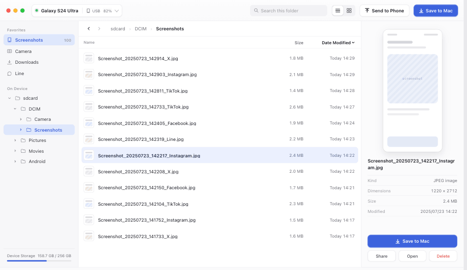

# DroidFinder (macOS)

An Android file access tool that runs on macOS (USB + ADB). Browse your phone's directories and download files to your Mac.



## Open and Build with Xcode

1. Open the project: `DroidFinder.xcodeproj`
2. At the top of Xcode, select the scheme: `DroidFinder`
3. Select the target platform: `My Mac`
4. Run or build:
   - Run: `Cmd + R`
   - Build: `Cmd + B`

## Build a DMG from the Command Line

Run from the project root:

```bash
./scripts/build_dmg.sh
```

Output paths:

- `.app`: `build/DerivedData/Build/Products/Release/DroidFinder.app`
- `.dmg`: `build/DroidFinder.dmg`

## Archive and Export in Xcode

1. Menu `Product -> Archive`
2. Select the archive in the Organizer
3. Click `Distribute App`
4. Choose an export method (for local distribution, you can select `Copy App`)

## Prerequisites

1. Install `adb` (Android Platform Tools) on your Mac
2. Enable USB debugging on your Android device
3. On first connection, tap to allow debugging authorization on your phone
